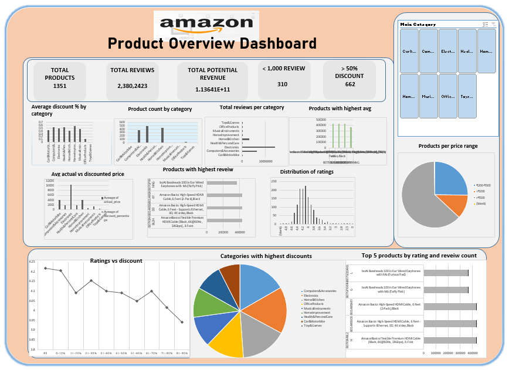

##  Amazon Product Review Analysis

###  Overview

This project involved analyzing a dataset of Amazon product reviews to extract insights on pricing, product categories, customer behavior, and sales potential. The analysis was done entirely in **Microsoft Excel**, including data cleaning, visualizations, and an interactive dashboard.

###  Dataset Summary

- **Records:** 1,465 products  
- **Features:** 16 columns  
  - Product Name  
  - Category  
  - Price (Original & Discounted)  
  - Customer Rating  
  - Number of Reviews  
  - Discount %

---

###  Analysis Objectives

- Average discount % per category  
- Product count per category  
- Total reviews by category  
- Highest rated products  
- Price comparisons (actual vs discounted)  
- Top reviewed products  
- Products with 50%+ discount  
- Rating distribution  
- Revenue potential by category  
- Price range segmentation  
- Ratings vs discount trends  
- Products with <1,000 reviews  
- Highest discounting categories  
- Top 5 products (ratings + reviews)

---

###  Tools Used

- Microsoft Excel  
  - Formulas  
  - Pivot Tables  
  - Bar, Column & Pie Charts  
  - Slicers  
  - Conditional Formatting  
  - Dashboard Design

---

###  Dashboard Features

- KPI Cards  
- Dynamic bar and column charts  
- Pie chart for rating distribution  
- Interactive slicers for category filtering  
- Clean layout for easy decision-making

---

###  Key Insights

- ₹200–₹500 priced products with high ratings are optimal for promotion  
- Best visibility is achieved with **30–60% discounts**  
- Low-rated but heavily discounted products may require quality improvements
- Customer reviews revealed that products with higher star ratings and detailed positive feedback tend to drive more engagement and repeat purchases. Categories like electronics and beauty products receive the most reviews, but also face the highest number of complaints—mostly around quality and delivery delays. Discounts and competitive pricing noticeably boost visibility, but they don’t guarantee better reviews unless product quality matches expectations.

  ### Recommendations
- Under-reviewed products should be targeted for review campaigns
- Focus on improving product quality and delivery speed, especially in high-review categories like electronics and beauty, where complaints are most common. Encourage happy customers to leave reviews, as strong ratings drive trust and repeat purchases. Use discounts wisely—pair them with product improvements, not just lower prices. Monitor negative reviews closely to fix recurring issues and adjust marketing to reflect customer feedback. Small improvements based on reviews can significantly boost credibility and long-term sales. 

---

###  Files

- [Amazon_Analysis.xlsx](./Amazon_Analysis.xlsx)-Cleaned data, pivot tables, and dashboard  
- [Dashboard.png](./Dashboard.png) – Dashboard preview image

---
## Dashboard

